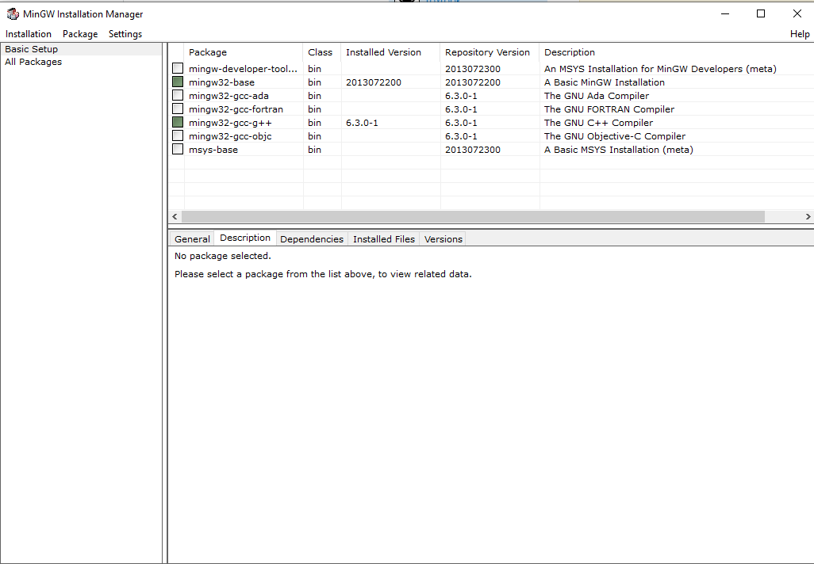

# c-learning
This repository is used to create a personal reference of more advanced C concepts; starting from the base axioms.

# Getting Started
## Compiler Installation for Windows 10
1. Download the download the [mingw compiler](https://sourceforge.net/projects/mingw/files/latest/download) from [Sourceforge](https://sourceforge.net/projects/mingw/).

2. Launch the exe file once the download is complete. 
  * Leave the install path at the default location \([highlighted](#markdown-style) below.\).
  * When prompted, ensure you enable the gui installation. [^1]

3. After installation occurs, launch the GUI \(graphical user interface[^2]\). If you left the path at the default location, it should be at:
  > C:\MinGW\libexec\mingw-get\guimain.exe

4. You should see a window as pictured [below](#mingw-installation-manager)[^3].

5. Select for installation. This can be changed at anytime later.
  * For C Language installation, right click the `mingw32-base` option and select the "[Mark for Installation](#mingw-marking-for-installation)" option.
  * For C++ Language installation, right click the `mingw32-gcc-g++` option and select the "[Mark for Installation](#mingw-marking-for-installation)" option.

6. Install your selections by clicking the "Installation" tool bar item and selecting "Apply Changes" in the resulting [drop down](#mingw-installing-selected-items).

7. Verify your installation by pressing the windows key <kbd>Windows</kbd>, typing "cmd" and pressing "Enter" <kbd>Return</kbd>. In the prompt type the path to the gcc executable:
  > C:\MinGW\bin\gcc.exe -v

8. The install was successful if you see a multiline output that has a final line that states:
  > gcc version x.x.x (MinGW.org GCC-x.x.x-x)[^4]

9. To complete setup, we must add the gcc compiler to the [path](#mingw-adding-to-path) environment variable.

[^1]: You may uncheck the start menu and desktop shortcut creation options circled in red. You likely will not use those shortcuts if created.
[^2]: Sometimes pronounced as an acronym G.U.I. and sometimes pronounced as a word "gooey".
[^3]: In the referenced image, the tick boxes for "mingw32-base" and "mingw32-gcc-g++" are green. If you do **not** want to install c++ then do not select the second item "mingw32-gcc-g++."
[^4]: Where the 'x' character is replaced by numbers.

## Compiler Installation Reference Images
### Mingw Splash Screen

### Mingw Install Choices

### MinGW Installation Manager

### MinGW Marking For installation

### MinGW Installing Selected Items

## MinGW Adding To Path
1. Press the windows key <kbd>Windows</kbd> and select the first option that comes up when `environment` is entered into the search bar.

2. Once the window titled "System Properties" is open, if not on the "Advanced" tab, switch to it. Near the bottom of the window is a button with the label "Environnment Variables...", click on it.

3. The resulting window is divided into two primary sections; "User variables" and "System variables". In the system variables space highlight the "Path" entry in the "Variable" column by left clicking it.

4. With the "Path" entry still highlighted, click the "Edit..." button beneath the "System Variables" section.

5. A new window titled "Edit environment variable" should now be open. Select the "New" button at the top of the column of buttons on the right region of the screen.

6. A section for text entry should appear. Type or copy and paste the following in the text entry:
  > C:\MinGW\bin\

7. Now press the "OK" button on the current window as well as the others that opened.

8. Verify this worked by pressing the windows key <kbd>Windows</kbd>, typing "cmd" and pressing "Enter" <kbd>Return</kbd>. In the prompt type:
  > gcc -v

  * If you installed c++ you can also try:
  > g++ -v

9. If you see the same output as before when the compiler installation was initially verified, then you are done with compiler installation and setup.

## Compilation via command line

### Tool invocation
The gcc compiler can be invoked with the command `gcc` or `g++` in the case of C++[^5].

[^5]: From here on out, C++'s existence will be ignored as that languages features go beyond the scope of this repository's purpose.
